# Green Street - Transaction Management App

A modern, responsive transaction management application built with Next.js, Supabase, and shadcn/ui.

## 🚀 Features

### Core Functionality

- **User Authentication** - Secure login/logout with Supabase Auth
- **Transaction Management** - Create, view, and track transactions
- **Contractor Management** - Search and select contractors with avatars
- **Real-time Data** - Live updates using SWR for data fetching
- **Status Tracking** - Transaction states: SEND (red), RECEIVED (yellow), PAYED (green)

### User Experience

- **Responsive Design** - Mobile-first approach with breakpoint optimization
- **Search & Filter** - Real-time search across transactions and contractors
- **Sortable Tables** - Click column headers to sort by date, amount, or contractor
- **Smart Forms** - Self-transaction prevention and form validation
- **Toast Notifications** - User feedback with Sonner
- **Loading States** - Proper loading indicators throughout the app

### Technical Features

- **Server Actions** - Next.js 13+ server actions for database operations
- **Type Safety** - Full TypeScript with Zod validation
- **Responsive Tables** - Horizontal scroll on mobile, proper overflow handling
- **Sticky Header** - Persistent navigation with adaptive sizing
- **Debounced Search** - Optimized search with 300ms debouncing

## 🛠️ Tech Stack

- **Framework**: Next.js 15 with App Router
- **Database**: Supabase (PostgreSQL)
- **Authentication**: Supabase Auth + Next.js Middleware
- **API Layer**: Next.js API Routes (RESTful endpoints)
- **Data Layer**: Server Actions (Database operations)
- **Services**: Custom API client with HTTP requests
- **UI Components**: shadcn/ui
- **Styling**: Tailwind CSS
- **Icons**: Lucide React
- **Data Fetching**: SWR with caching
- **Validation**: Zod (Type-safe schemas)
- **Notifications**: Sonner
- **Package Manager**: pnpm

## 📦 Installation

1. Clone the repository:

```bash
git clone https://github.com/YOUR_USERNAME/green-street.git
cd green-street
```

2. Install dependencies:

```bash
pnpm install
```

3. Set up environment variables:

```bash
cp .env.example .env.local
```

Add your Supabase credentials:

```env
NEXT_PUBLIC_SUPABASE_URL=your_supabase_url
NEXT_PUBLIC_SUPABASE_ANON_KEY=your_supabase_anon_key
```

4. Run database migrations:

```bash
# Run the SQL files in the migrations/ folder in your Supabase dashboard
```

5. Start the development server:

```bash
pnpm dev
```

## 🗃️ Database Schema

### Contractors Table

- `id` (UUID, Primary Key)
- `name` (Text)
- `image` (Text, Profile image URL)
- `created_at` (Timestamp)

### Transactions Table

- `id` (UUID, Primary Key)
- `date` (Date)
- `account_from` (UUID, Foreign Key to contractors)
- `account_to` (UUID, Foreign Key to contractors)
- `amount` (Integer, stored in cents)
- `state` (Enum: SEND, RECEIVED, PAYED)
- `created_at` (Timestamp)

## 🏗️ Project Structure

```
green-street/
├── actions/              # Server actions (Database layer)
├── app/
│   ├── api/             # REST API endpoints (Route handlers)
│   │   ├── contractors/ # Contractor CRUD operations
│   │   └── transactions/# Transaction CRUD operations
│   └── ...              # Next.js app router pages
├── components/           # Reusable React components
│   ├── ui/              # shadcn/ui base components
│   └── ...              # Custom application components
├── hooks/               # Custom React hooks with SWR
├── lib/                 # Utility libraries (Supabase client)
├── services/            # API client and data mapping layer
├── middleware.ts        # Authentication middleware
├── migrations/          # Database migration scripts
├── types/
│   ├── database.ts      # Raw database types
│   └── domain.ts        # Validated domain types (Zod)
└── utils/               # Utility functions and constants
```

## 🏗️ Layered Architecture

The application follows a clean layered architecture with clear separation of concerns:

### 🎨 1. Presentation Layer (Components)

- **HomePage** - Dashboard with transaction table and create form
- **TransactionsTable** - Sortable, searchable transaction display
- **CreateTransactionForm** - Form for creating new transactions
- **ContractorSelect** - Searchable contractor dropdown
- **TransactionView** - Detailed transaction page

### 🪝 2. Application Layer (Hooks)

- **useContractors** - Fetches and caches contractor data
- **useTransactions** - Manages transaction operations
- **useTransactionFiltering** - Handles search/sort logic
- Uses **SWR** for data fetching with automatic caching

### 🌐 3. Services Layer

- **ContractorsService** - Maps contractor data and handles validation
- **TransactionsService** - Maps transaction data and handles validation
- **ApiClient** - Generic HTTP client with error handling
- Converts **Database Types** → **Domain Types** with **Zod validation**

### 🔗 4. API Layer (REST Endpoints)

```
GET    /api/contractors           # List all contractors
GET    /api/contractors/search    # Search contractors
GET    /api/contractors/[id]      # Get contractor by ID
GET    /api/transactions          # List all transactions
POST   /api/transactions          # Create transaction
GET    /api/transactions/[id]     # Get transaction by ID
PATCH  /api/transactions/[id]/state # Update transaction status
```

### ⚙️ 5. Data Layer (Server Actions)

- **actions/contractors.ts** - Database operations for contractors
- **actions/transactions.ts** - Database operations for transactions
- **actions/auth.ts** - Authentication operations
- Direct Supabase integration with type safety

### 🛡️ 6. Security Layer (Middleware)

- **Authentication** - Protects all API routes and pages
- **Session Management** - Handles login/logout redirects
- **API Protection** - Returns 401 for unauthorized requests

## 🔧 Key Architecture Features

### Type-Safe Data Flow

```typescript
// Database Layer (Server Actions)
export async function getContractors(): Promise<{ data: ContractorRow[] | null, error: string | null }>

// API Layer (Route Handlers)
export async function GET() {
  const result = await getContractors();
  return NextResponse.json({ data: result.data, error: null });
}

// Services Layer (Data Mapping + Validation)
async getContractors(): Promise<Contractor[]> {
  const contractorRows = await apiClient.get<ContractorRow[]>(API_ENDPOINTS.CONTRACTORS.LIST);
  return contractorRows.map(mapContractorToDomain); // Zod validation
}

// Application Layer (Hooks + SWR)
export function useContractors() {
  const { data, error, isLoading } = useSWR(SWR_KEYS.CONTRACTORS, contractorsFetcher);
  return { contractors: data || [], isLoading, isError: !!error };
}
```

### Middleware Authentication

```typescript
// All API routes are automatically protected
export async function middleware(req: NextRequest) {
  const isApiRoute = pathname.startsWith("/api/");
  if (isApiRoute && !session) {
    return NextResponse.json({ error: "Unauthorized" }, { status: 401 });
  }
}
```

### Services with Zod Validation

```typescript
// Raw database types → Validated domain types
function mapContractorToDomain(contractorRow: ContractorRow): Contractor {
  const result = ContractorSchema.safeParse({
    id: contractorRow.id,
    name: contractorRow.name,
    image: contractorRow.image,
    created_at: contractorRow.created_at,
  });
  if (!result.success) throw new Error("Invalid contractor data");
  return result.data;
}
```

### SWR Integration

```typescript
// Automatic caching with defined keys
export const SWR_KEYS = {
  CONTRACTORS: "contractors",
  CONTRACTOR_SEARCH: (query: string) => `contractors-search-${query}`,
  TRANSACTIONS: "transactions",
} as const;
```

## 🚀 Deployment

The application is ready for deployment on platforms like Vercel, Netlify, or any hosting service that supports Next.js.

### Vercel Deployment

1. Connect your GitHub repository to Vercel
2. Add environment variables in Vercel dashboard
3. Deploy automatically on git push

## 📱 Mobile Optimization

- **Touch-friendly** interfaces with proper spacing
- **Horizontal scroll** for wide tables
- **Adaptive text sizing** based on screen size
- **Sticky header** that works on mobile browsers
- **Optimized forms** with proper keyboard types

## 🔒 Security Features

- **Centralized Authentication** - Middleware protects all API routes
- **Layered Validation** - Zod schemas validate data at service layer
- **Type Safety** - End-to-end TypeScript with database and domain types
- **Server-side Validation** - All forms validated on server actions
- **Protected API Endpoints** - 401 responses for unauthorized requests
- **SQL Injection Protection** - Supabase handles query sanitization
- **XSS Protection** - Proper escaping and validation throughout

## 📊 Data Flow Diagram

```mermaid
graph TD
    A[🎨 Components] --> B[🪝 Hooks + SWR]
    B --> C[🌐 Services]
    C --> D[🔗 API Routes]
    D --> E[⚙️ Server Actions]
    E --> F[🗄️ Supabase]

    G[🛡️ Middleware] --> D
    B --> H[📦 SWR Cache]
    C --> I[✅ Zod Validation]
```



The application maintains strict separation between:

- **Database Types** (`types/database.ts`) - Raw Supabase schema
- **Domain Types** (`types/domain.ts`) - Validated business logic types

## 📄 License

This project is open source and available under the [MIT License](LICENSE).

## 🤝 Contributing

Contributions are welcome! Please feel free to submit a Pull Request.

## 🐛 Bug Reports

If you encounter any issues, please create an issue on GitHub with detailed information about the problem.
